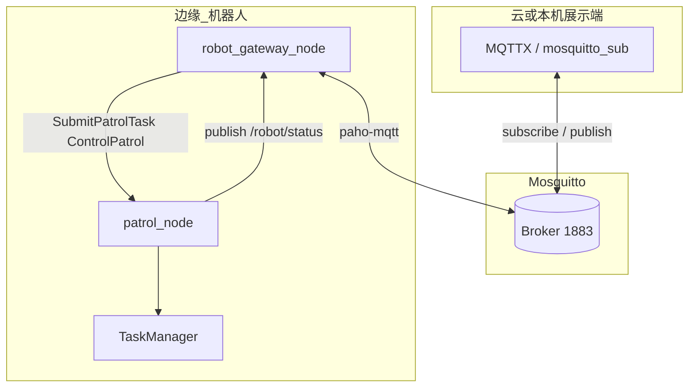
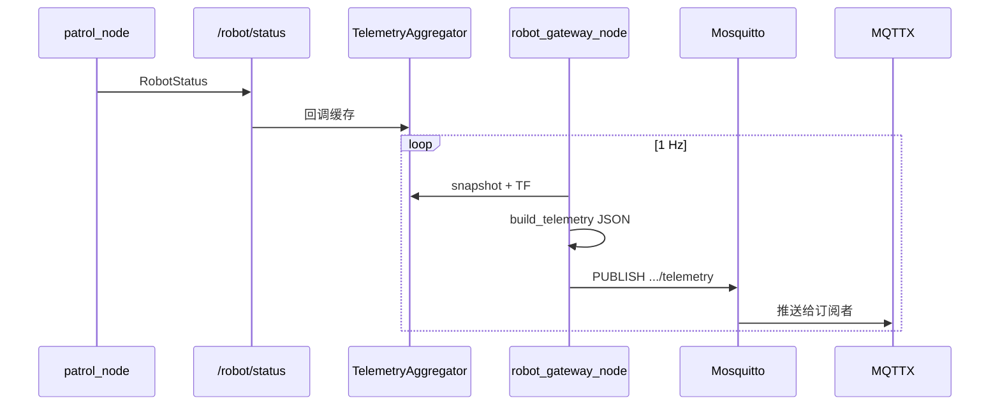
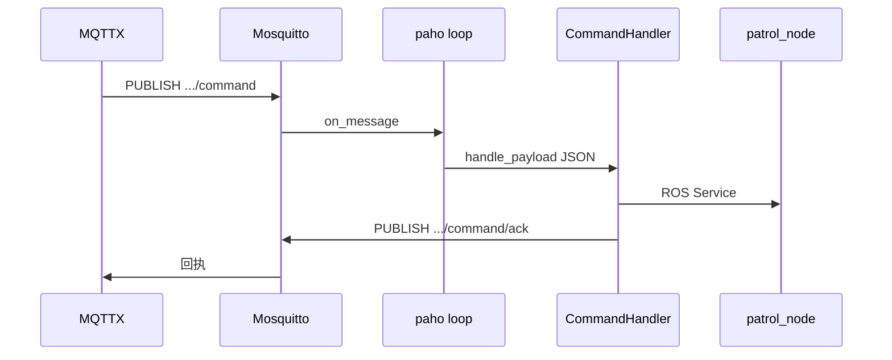

# IoT 网关节点（robot_gateway_node）架构说明

巡逻机器人的 **云边端 MQTT 网关**：边端负责巡逻与状态，网关做 ROS ↔ JSON ↔ MQTT 协议适配，云端（或本机 MQTTX）通过 **Broker** 订阅遥测、下发命令。

---

## 1. 设计原则


| 原则              | 说明                                         |
| --------------- | ------------------------------------------ |
| 网关不碰 Nav2/Skill | 只通过 ROS 话题/服务与 `patrol_node` 交互            |
| 边端用 ROS 强类型     | `patrol_interfaces/msg/RobotStatus` + 任务服务 |
| 对外用统一 JSON      | MQTT payload；二期 HTTP 可复用同一 schema          |
| Broker 即消息中枢    | 网关是 **MQTT 客户端**，无单独「转发服务器」                |


---

## 2. 总体架构




| 组件                   | 职责                              |
| -------------------- | ------------------------------- |
| `patrol_node`        | 巡逻状态机；发布 `/robot/status`；提供任务服务 |
| `robot_gateway_node` | 订阅状态、查 TF/电量；拼 JSON；MQTT 上下行    |
| Mosquitto            | 遥测与命令的发布/订阅中枢（演示时本机即「云」）        |


---

## 3. ROS 与 MQTT 的分工

### 3.1 边端：RobotStatus（Topic，非 Service）

- 定义：`patrol_interfaces/msg/RobotStatus.msg`
- 发布：`patrol_node` → 话题 `/robot/status`（`TaskManager` 状态变化时更新）
- 字段：`robot_id`、`task_id`、`state`、`waypoint_index/total`、`fault_code` 等

### 3.2 网关：订阅 + 翻译（Python）


| 模块  | 文件                                | 作用                                                          |
| --- | --------------------------------- | ----------------------------------------------------------- |
| 聚合  | `gateway/telemetry_aggregator.py` | 订阅 `/robot/status`；TF 位姿；电量；离线超时 → `offline`                |
| 序列化 | `gateway/schema.py`               | `RobotStatus` 快照 → 对外 JSON（`progress`、`timestamp`、`source`） |
| 传输  | `gateway/mqtt_transport.py`       | 连接 Broker；publish 遥测；subscribe 命令                           |
| 命令  | `gateway/command_handler.py`      | JSON → `submit_patrol_task` / `control_patrol`              |
| 入口  | `robot_gateway_node.py`           | 定时 1 Hz 发遥测；组装上述模块                                          |


### 3.3 遥测字段来源


| JSON 字段                                        | 来源                                       |
| ---------------------------------------------- | ---------------------------------------- |
| `task_id`、`state`、`progress.*`、`fault_code`    | `/robot/status`                          |
| `pose`                                         | 网关 TF `map` → `base_link`（与导航一致）         |
| `battery`                                      | `mock_battery_percent` 或 `battery_topic` |
| `timestamp`、`progress.waypoint_label`、`source` | 仅 JSON 层（`schema.py`）                    |


---

## 4. 数据流

### 4.1 上行：状态上报（边 → 云）




1. `patrol_node` 发布 `RobotStatus`
2. 定时器调用 `snapshot()` → `build_telemetry()`
3. `MqttTransport.publish_telemetry()` 发到 `robots/{robot_id}/telemetry`（默认 **retain**）

云端 = 任意连接同一 Broker 并订阅该主题的客户端，不是网关再转发到另一台程序。

### 4.2 下行：命令下发（云 → 边）




1. 网关连接时 **subscribe** `.../command`（`paho` 后台 `loop_start()`）
2. 收到 JSON → `CommandHandler` 解析 `action`
3. 调用 `submit_patrol_task` 或 `control_patrol`
4. **publish** `.../command/ack`；可选发 `.../events`


| `action` | ROS 行为 |
|----------|----------|
| `start_task` | `SubmitPatrolTask` |
| `update_patrol` | 先 cancel 再提交新路点 |
| `pause_patrol` / `resume_patrol` / `cancel_patrol` | `ControlPatrol` |

样例 JSON：`docs/mqtt_demo/`（`start_inspection_A.json`、`pause.json` 等）。

### 4.3 云端 command 能编排什么

编排发生在边端 **`TaskManager`**（导航 + 到点 Skill 链），云端只下发任务参数与控制指令，**不能**用 MQTT 逐条配置「先录像再播报」等动作 DSL。

| 能编排 | JSON / 服务字段 | 说明 |
|--------|-----------------|------|
| 任务标识 | `task_id` | 写入遥测，区分本地 `local_patrol` 与远程任务 |
| 任务模板 | `task_name` | 对应 `config/tasks/*.yaml` 中的任务名 |
| 初始位姿 | `initial_pose`（可选） | JSON 含该字段时重设 AMCL（含 `{0,0,0}`）；省略则不改动 |
| 生命周期 | `action` | 启动 / 热更新路点 / 暂停 / 恢复 / 取消 |

到点后的 **语音 → 拍照 → 语音** 序列固定在 `TaskManager`，远程不可改顺序。

**两类「结果」（勿混淆）**

| 类型 | 通道 | 含义 |
|------|------|------|
| 命令受理 | `command/ack` | 立刻返回：`accepted` + `message`（如「任务已排队」），**不是**全程跑完 |
| 执行过程 | `telemetry`、`events`、`/robot/status` | `state`、`progress`、`fault_code` 等持续更新 |

纯 MQTT 演示时建议 `patrol_config.yaml` 设 `auto_start_task: false`，避免默认任务抢占。

---

## 5. MQTT 主题

前缀默认 `robots/robot_001`（`gateway_config.yaml` → `mqtt_topic_prefix`）。


| 主题                | 方向  | Retain | 说明                         |
| ----------------- | --- | ------ | -------------------------- |
| `.../telemetry`   | 上行  | true   | 约 1 Hz 全量状态                |
| `.../online`      | 上行  | true   | 在线；断线 LWT → `online:false` |
| `.../events`      | 上行  | false  | 状态变更、命令受理等                 |
| `.../command`     | 下行  | false  | 云端/MQTTX 在此 Publish        |
| `.../command/ack` | 上行  | false  | 命令回执                       |


**推荐订阅（MQTTX / CLI）**：`robots/robot_001/#`

### 遥测 JSON 示例

```json
{
  "robot_id": "robot_001",
  "task_id": "inspection_A",
  "state": "navigating",
  "progress": { "waypoint_index": 1, "waypoint_total": 3, "waypoint_label": "2/3" },
  "pose": { "x": 3.2, "y": -1.0, "yaw": 0.0 },
  "battery": 78,
  "fault_code": null,
  "timestamp": "2026-05-20T12:00:00Z",
  "source": "edge"
}
```

`state`：`offline` | `initializing` | `idle` | `navigating` | `at_waypoint` | `retry_wait` | `paused` | `finished` | `fault`

---

## 6. ROS 2 接口一览


| 类型      | 名称                    | 类型名                                      |
| ------- | --------------------- | ---------------------------------------- |
| Topic   | `/robot/status`       | `patrol_interfaces/msg/RobotStatus`      |
| Service | `/submit_patrol_task` | `patrol_interfaces/srv/SubmitPatrolTask` |
| Service | `/control_patrol`     | `patrol_interfaces/srv/ControlPatrol`    |

`SubmitPatrolTask`：提交 `task_name` + `task_id`，由 patrol_node 在 DSL 库中查找并执行。

---

## 7. 云边端演示（MQTTX）

### 7.1 前置

```bash
sudo apt install mosquitto mosquitto-clients
sudo systemctl start mosquitto
pip3 install paho-mqtt
python3 -c "import paho.mqtt.client"   # 无报错再继续
```

### 7.2 启动与连接

```bash
source /opt/ros/humble/setup.bash
source ~/Desktop/projects/my_robot_ws/install/setup.bash
ros2 launch patrol_robot one_in_all.launch.py
```


| 检查        | 命令 / 现象                                                 |
| --------- | ------------------------------------------------------- |
| 网关在跑      | `ros2 node list | grep gateway` → `/robot_gateway_node` |
| launch 日志 | `MQTT 已连接`、`IoT 网关已启动`                                  |


**MQTTX**：Host `127.0.0.1`，Port `1883`，订阅 `robots/robot_001/#`。

无 Broker 时仅关网关：`enable_gateway:=false`。

### 7.3 命令行

```bash
mosquitto_sub -h 127.0.0.1 -t 'robots/robot_001/#' -v

mosquitto_pub -h 127.0.0.1 -t 'robots/robot_001/command' -m \
  '{"command_id":"t1","action":"start_task","task_name":"inspection_route_A","task_id":"inspection_A"}'
```

---

## 8. 配置


| 文件                                        | 内容                                      |
| ----------------------------------------- | --------------------------------------- |
| `patrol_robot/config/gateway_config.yaml` | Broker、`robot_id`、主题前缀、遥测频率、mock 电量     |
| `patrol_robot/config/patrol_config.yaml`  | `robot_id`、`auto_start_task`、`default_task_name` |


---

## 9. 常见问题


| 现象                                        | 原因                       | 处理                                                 |
| ----------------------------------------- | ------------------------ | -------------------------------------------------- |
| `mosquitto_sub` 无输出                       | `robot_gateway_node` 未运行 | 查 `ros2 node list | grep gateway`                  |
| launch 无网关                                | 缺少 `paho-mqtt`           | `pip3 install paho-mqtt` 后**重启 launch**            |
| `ros2 topic echo /robot/status` 报 invalid | 未 source 工作区             | `source install/setup.bash`                        |
| 有 `/robot/status` 但无 MQTT                 | 只有 patrol，网关未起           | 同上，装 paho 并确认网关节点                                  |
| MQTTX 无数据但节点在                             | Broker 未启或地址错            | `systemctl status mosquitto`；核对 `mqtt_broker_host` |

---

## 10. 代码目录

```
patrol_robot/patrol_robot/
├── robot_gateway_node.py
└── gateway/
    ├── telemetry_aggregator.py
    ├── mqtt_transport.py
    ├── command_handler.py
    └── schema.py
```

---

## 11. 相关文档

- [TASK_SKILL_ARCHITECTURE.md](TASK_SKILL_ARCHITECTURE.md) — TaskManager / Skill；§10 行为树（BT）演进
- [MANUAL.md](MANUAL.md) — 环境、一键启动、排查

