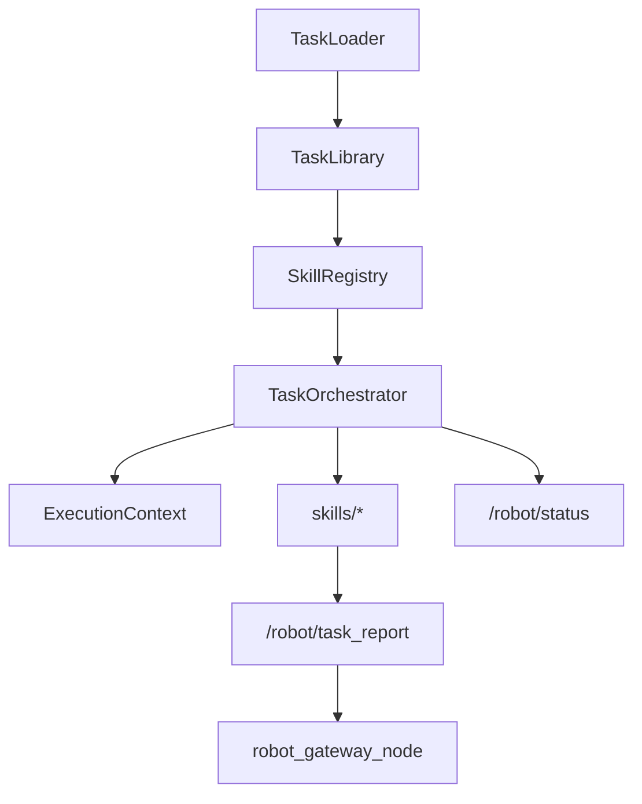

# YAML 任务 DSL 编排架构

本文档描述如何将巡逻逻辑从“写死循环”升级为“YAML 驱动任务编排”。

---

## 1. 目标

- 用 `config/stations.yaml` + `config/tasks/*.yaml` 描述任务，不再硬编码 `patrol_points`。
- 用 `TaskOrchestrator` 顺序执行 `steps`，复用现有 Skill。
- 支持新增步骤类型：`detect_anomaly`、`report`。
- 支持 MQTT 下发 `start_task`，按任务名启动。

---

## 2. 配置文件

### 2.1 站点

`patrol_robot/config/stations.yaml`

```yaml
stations:
  station_1: { x: 3.2, y: -1.0, yaw_deg: 0.0 }
  station_2: { x: 4.7, y: -4.7, yaw_deg: 0.0 }
  home: { x: 0.0, y: 0.0, yaw_deg: 0.0 }
```

### 2.2 任务

`patrol_robot/config/tasks/inspection_route_A.yaml`

```yaml
name: inspection_route_A
task_id: inspection_A
steps:
  - type: navigate
    target: station_1
  - type: speak
    text: "到达一号巡检点"
    optional: true
  - type: capture_image
    save_tag: station_1
  - type: detect_anomaly
    model: mock_detector
  - type: report
    channel: mqtt
```

---

## 3. 执行模型



| 组件 | 作用 |
|------|------|
| `TaskLoader` | 解析并校验 YAML |
| `TaskOrchestrator` | 按 steps 执行、处理暂停/取消 |
| `SkillRegistry` | `type -> handler` 映射 |
| `ExecutionContext` | 传递 `task_id`、`step_index`、`last_image_path`、`last_anomaly` |

---

## 4. 支持的步骤

| type | 必填字段 | 行为 |
|------|----------|------|
| `navigate` | `target` | 导航到站点 |
| `speak` | `text` | 语音播报 |
| `capture_image` | `save_tag` | 拍照并记录路径 |
| `wait` | `seconds` | 等待 |
| `detect_anomaly` | `model` | 模拟异常检测 |
| `report` | `channel` | 发布 `TaskReport` |

任意步骤可设置 **`optional: true`**（默认 `false`）。失败或异常时仅记录警告并**继续下一步**，不触发任务级 `on_failure`；`navigate` 一般不要设为可选。语音在无网环境建议对 `speak` 使用 `optional: true`，与 DSL 改版前的「播报失败仍继续巡逻」行为一致。

```yaml
  - type: speak
    text: "已到达目标点，准备拍照"
    optional: true
```

---

## 5. ROS 接口变化

- `patrol_interfaces/msg/RobotStatus.msg` 增加：
  - `step_index`
  - `step_total`
  - `current_step_type`
- 新增 `patrol_interfaces/msg/TaskReport.msg`
- `patrol_interfaces/srv/SubmitPatrolTask.srv` 改为：

```text
string task_name
string task_id
---
bool success
string message
```

---

## 6. MQTT 命令

Topic: `robots/robot_001/command`

```json
{
  "command_id": "demo-start-001",
  "action": "start_task",
  "task_name": "inspection_route_A",
  "task_id": "inspection_A"
}
```

---

## 7. 运行参数

`patrol_robot/config/patrol_config.yaml`

```yaml
patrol_node:
  ros__parameters:
    task_config_dir: ""
    auto_start_task: true
    default_task_name: "legacy_room_patrol"
```

`task_config_dir` 为空时默认使用包内 `share/patrol_robot/config`。

---

## 8. 迁移说明

- 旧字段 `patrol_points` 已废弃。
- 兼容任务已提供：`config/tasks/legacy_room_patrol.yaml`。
- 推荐通过 MQTT `start_task` 或服务 `/submit_patrol_task` 触发任务。
