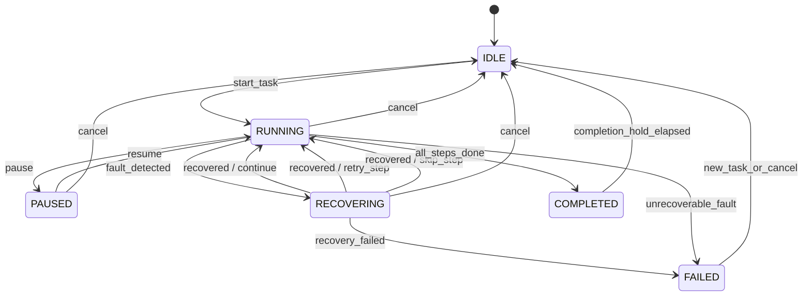
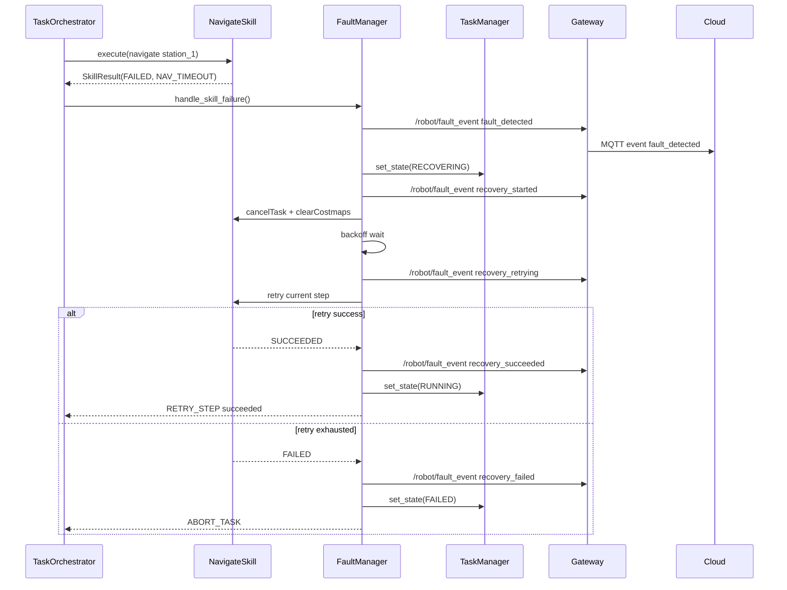
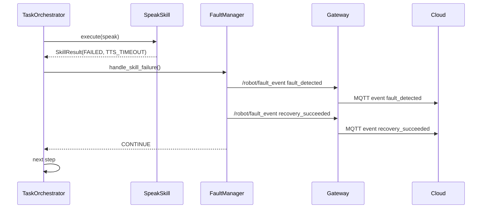

# 故障管理与自恢复技术方案

> 适用工程：`patrol_robot` / `robot_gateway_node` / `patrol_interfaces`
> 方案阶段：架构设计评审稿
> 设计目标：在现有 ROS 2 巡检任务编排基础上，建立统一、稳定、易扩展的故障检测、分类、恢复与云端上报闭环。

---

## 1. 背景与目标

工业机器人对可靠性、可观测性和可恢复性要求较高。当前工程已经具备：

- YAML DSL 驱动的巡检任务编排；
- `TaskManager + TaskOrchestrator + Skill` 的应用层结构；
- Nav2 导航能力；
- 语音、拍照、异常检测、任务报告等 Skill；
- `/robot/status` 与 MQTT telemetry/events 云端上报链路。

但现有故障处理仍较分散：

- 导航失败主要依赖固定等待后重试；
- Skill 失败只返回 `SkillResult`，缺少统一故障分类；
- TTS、拍照、导航等故障处理策略散落在各自调用点；
- 云端只能看到 `fault_code` 或状态变化，无法形成故障全生命周期闭环；
- 任务状态语义与目标状态机不完全一致。

本方案目标是建立一套轻量但清晰的故障管理架构：

```text
故障检测 -> 故障分类 -> 恢复动作 -> 云端上报 -> 任务继续/中止
```

重点能力：

1. 导航失败重试策略；
2. 超时检测；
3. 服务不可用降级；
4. 相机无图像告警；
5. TTS 失败不阻断主任务；
6. 统一任务状态机：`IDLE / RUNNING / PAUSED / FAILED / RECOVERING / COMPLETED`；
7. 故障生命周期上报：检测、恢复中、恢复成功、恢复失败。

---

## 2. 设计原则

| 原则 | 说明 |
|------|------|
| 工程内聚 | 基于现有 `TaskManager / TaskOrchestrator / Skill / Gateway` 演进，不引入大型行为树或复杂调度框架 |
| 分层清晰 | Skill 负责检测局部异常，FaultManager 负责分类和恢复决策，TaskManager 负责状态机 |
| 策略集中 | 重试次数、退避等待、故障是否阻断任务等策略集中配置 |
| 故障闭环 | 云端可看到故障从发生到恢复或失败的完整生命周期 |
| 默认安全 | 导航类故障默认阻断任务；TTS 和相机无图默认告警后继续 |
| 可扩展 | 新增故障码、恢复动作、事件字段不影响任务编排主流程 |
| 不做兼容包袱 | 本项目为预研阶段，不保留旧状态字符串和旧 schema 的兼容逻辑 |

---

## 3. 范围与非目标

### 3.1 本期范围

- 新增统一故障模型；
- 新增轻量 `FaultManager`；
- 重构任务状态机为目标状态；
- 为导航、TTS、拍照、相机无图像提供默认恢复策略；
- 新增故障事件上报链路；
- MQTT events 区分故障检测、恢复中、恢复成功、恢复失败；
- 配置化关键恢复策略；
- `capture_image` 默认失败后告警并继续，但允许单个任务或步骤配置为阻断。

### 3.2 本期非目标

- 不实现云端 `resume` 已失败任务；
- 不实现失败后回原点、回充或移动到安全点；
- 不扩展每个 DSL step 的复杂自定义恢复策略；
- 不替换业务编排为行为树；
- 不解决 gTTS 网络依赖问题；
- 不做故障历史持久化，仅做实时上报；
- 不考虑旧 MQTT schema 与旧状态字符串兼容。

---

## 4. 总体架构

```mermaid
flowchart TB
    subgraph task [任务编排层]
        TM[TaskManager\n任务状态机]
        TO[TaskOrchestrator\n顺序执行 DSL steps]
        FM[FaultManager\n故障分类与恢复决策]
    end

    subgraph skill [Skill 层]
        Nav[NavigateSkill]
        Speak[SpeakSkill]
        Capture[CaptureImageSkill]
        Detect[DetectAnomalySkill]
        Report[ReportSkill]
    end

    subgraph service [能力与基础设施]
        Nav2[Nav2]
        TTS[audio_player_node]
        Camera[capture_image_node]
    end

    subgraph cloud [云端上报]
        Status[/robot/status]
        FaultEvent[/robot/fault_event]
        Gateway[robot_gateway_node]
        MQTT[MQTT telemetry/events]
    end

    TM --> TO
    TO --> SkillExec[SkillRegistry]
    SkillExec --> Nav
    SkillExec --> Speak
    SkillExec --> Capture
    SkillExec --> Detect
    SkillExec --> Report

    Nav --> Nav2
    Speak --> TTS
    Capture --> Camera

    TO --> FM
    FM --> TM
    FM --> FaultEvent
    TM --> Status

    Status --> Gateway
    FaultEvent --> Gateway
    Gateway --> MQTT
```

### 4.1 职责划分

| 模块 | 职责 |
|------|------|
| `Skill` | 执行原子能力，识别本能力范围内的失败类型，返回结构化 `SkillResult` |
| `TaskOrchestrator` | 顺序执行 DSL step；遇到失败时交给 `FaultManager`，根据恢复结果决定下一步 |
| `FaultManager` | 故障分类、策略匹配、恢复动作执行、恢复生命周期事件发布 |
| `TaskManager` | 维护任务状态机，发布 `/robot/status`，处理任务开始/暂停/取消/完成/失败 |
| `robot_gateway_node` | 订阅状态和故障事件，转换为 MQTT telemetry/events |
| 云端 | 接收实时状态和故障生命周期事件，不参与本期恢复决策 |

---

## 5. 任务状态机

本期统一任务主状态：

| 状态 | 含义 |
|------|------|
| `IDLE` | 无任务运行，等待任务下发 |
| `RUNNING` | 任务执行中，包括导航、拍照、检测、上报等正常步骤 |
| `PAUSED` | 任务被人工或云端暂停 |
| `RECOVERING` | 检测到可恢复故障，正在执行恢复动作 |
| `FAILED` | 任务失败，恢复失败或达到中止条件 |
| `COMPLETED` | 任务执行完成，短暂停留后回到 `IDLE` |



### 5.1 状态发布规则

`/robot/status.state` 直接发布上述小写字符串：

- `idle`
- `running`
- `paused`
- `recovering`
- `failed`
- `completed`

当前执行细节通过已有字段表达：

- `current_step_type`
- `step_index`
- `step_total`
- `fault_code`

不再对外发布 `navigating`、`at_waypoint`、`retry_wait`、`finished` 等旧状态。

### 5.2 `COMPLETED` 停留

任务完成后进入 `COMPLETED`，保留一段可配置时间再回到 `IDLE`：

```yaml
task_completion_hold_sec: 5.0
```

目的：

- 让云端和 UI 稳定观察到任务完成态；
- 避免完成瞬间直接变回 `idle` 导致事件丢失或展示不清。

---

## 6. 故障模型

### 6.1 故障分类

```text
FaultCategory
├── NAVIGATION
├── SERVICE
├── SENSOR
├── PERCEPTION
├── REPORTING
├── TASK
└── SYSTEM
```

### 6.2 故障级别

| 级别 | 含义 | 默认影响 |
|------|------|----------|
| `INFO` | 非关键事件，仅用于观测 | 不影响任务 |
| `WARN` | 可降级或可跳过故障 | 默认继续或跳过 |
| `ERROR` | 需要恢复动作 | 进入 `RECOVERING` |
| `FATAL` | 不可恢复或恢复耗尽 | 进入 `FAILED` |

### 6.3 恢复结果

| 结果 | 含义 |
|------|------|
| `CONTINUE` | 故障已记录，任务继续执行下一步或当前步骤视为成功 |
| `RETRY_STEP` | 重试当前 step |
| `SKIP_STEP` | 跳过当前 step |
| `ABORT_TASK` | 中止任务，进入 `FAILED` |

---

## 7. 关键故障与默认策略

| 故障码 | 类别 | 默认级别 | 默认恢复动作 | 最终任务行为 |
|--------|------|----------|--------------|--------------|
| `NAV_FAILED` | `NAVIGATION` | `ERROR` | 取消当前导航、清理 costmap、退避等待、重试当前导航 | 超过上限后 `FAILED` |
| `NAV_TIMEOUT` | `NAVIGATION` | `ERROR` | 取消当前导航、清理 costmap、重试当前导航 | 超过上限后 `FAILED` |
| `TF_UNAVAILABLE` | `NAVIGATION` | `ERROR` | 等待 TF 恢复，重试当前导航 | 超过上限后 `FAILED` |
| `TTS_SERVICE_UNAVAILABLE` | `SERVICE` | `WARN` | 上报告警 | `CONTINUE` |
| `TTS_TIMEOUT` | `SERVICE` | `WARN` | 上报告警 | `CONTINUE` |
| `TTS_FAILED` | `SERVICE` | `WARN` | 上报告警 | `CONTINUE` |
| `CAMERA_SERVICE_UNAVAILABLE` | `SERVICE` | `WARN` | 上报告警，可按配置重试 | 默认 `CONTINUE` |
| `CAMERA_NO_IMAGE` | `SENSOR` | `WARN` | 上报告警，可按配置等待新帧重试 | 默认 `CONTINUE` |
| `CAMERA_STALE_IMAGE` | `SENSOR` | `WARN` | 上报告警，可按配置等待新帧重试 | 默认 `CONTINUE` |
| `CAPTURE_FAILED` | `SENSOR` | `WARN` | 上报告警，可按配置重试 | 默认 `CONTINUE` |
| `REPORT_FAILED` | `REPORTING` | `WARN` | 本地记录并上报状态 | `CONTINUE` |
| `STEP_EXCEPTION` | `TASK` | `ERROR` | 按任务失败策略处理 | 默认 `FAILED` |
| `TASK_FAILED` | `TASK` | `FATAL` | 上报失败 | `FAILED` |

### 7.1 导航恢复策略

导航恢复流程：

```text
1. 发现 NAV_FAILED / NAV_TIMEOUT
2. 发布 fault_detected
3. 状态切换为 RECOVERING
4. cancelTask()
5. clearAllCostmaps()
6. 按退避策略等待
7. 发布 recovery_started / recovery_retrying
8. 重试当前 navigate step
9. 成功：发布 recovery_succeeded，状态回 RUNNING
10. 失败且未达上限：继续恢复循环
11. 失败且达到上限：发布 recovery_failed，状态进入 FAILED
```

Nav2 内部 BT 已包含运动级恢复，本方案处理的是业务层导航 step 失败后的恢复闭环。

### 7.2 TTS 降级策略

TTS 属于非关键能力：

- 服务不可用、超时、播放失败均不阻断任务；
- 统一生成故障事件；
- 当前 `speak` step 视为已处理，任务继续；
- 不要求 YAML 中每个 `speak` 都显式配置 `optional: true`。

### 7.3 相机与拍照策略

拍照默认策略：

- `capture_image` 失败默认告警并继续；
- 相机无图像默认告警并继续；
- 支持具体任务配置为失败阻断。

建议第一版支持 step 级简单字段：

```yaml
steps:
  - type: capture_image
    save_tag: station_1
    required: true
```

语义：

- `required: false` 或未配置：失败后告警并继续；
- `required: true`：按 `capture_retry_max_attempts` 重试，耗尽后任务 `FAILED`。

该字段比完整 `recovery` DSL 更轻量，满足本期“默认继续、具体任务可配置”的要求。

---

## 8. 数据结构设计

### 8.1 `SkillResult` 扩展

当前 `SkillResult` 只有 `status` 和 `message`。建议扩展为：

```python
@dataclass
class SkillResult:
  status: SkillStatus
  message: str = ''
  fault_code: str = ''
  recoverable: bool = True
  details: dict[str, object] = field(default_factory=dict)
```

使用原则：

- Skill 只描述事实，不决定任务是否中止；
- 是否继续、重试、跳过、中止由 `FaultManager` 决定；
- `details` 用于携带服务名、目标点、超时时间、异常字符串等上下文。

### 8.2 故障上下文

```python
@dataclass
class FaultContext:
  task_id: str
  task_name: str
  step_type: str
  step_index: int
  step_total: int
  station: str
  fault_code: str
  message: str
  details: dict[str, object]
```

### 8.3 恢复决策

```python
@dataclass
class RecoveryDecision:
  action: RecoveryAction
  max_attempts: int
  wait_sec: float
  backoff_factor: float
  blocks_task: bool
```

### 8.4 恢复结果

```python
@dataclass
class RecoveryResult:
  outcome: RecoveryOutcome
  attempt: int
  max_attempts: int
  message: str
```

---

## 9. 故障生命周期事件

### 9.1 生命周期阶段

| 阶段 | 事件类型 | 触发时机 |
|------|----------|----------|
| 故障检测 | `fault_detected` | Skill 返回结构化失败或捕获异常 |
| 恢复开始 | `recovery_started` | `FaultManager` 进入恢复流程 |
| 恢复重试 | `recovery_retrying` | 即将重试当前 step |
| 恢复成功 | `recovery_succeeded` | 重试成功或降级继续 |
| 恢复失败 | `recovery_failed` | 重试耗尽或不可恢复 |
| 任务失败 | `task_failed` | 故障导致任务进入 `FAILED` |

### 9.2 ROS 消息

新增 `patrol_interfaces/msg/FaultEvent.msg`：

```text
string robot_id
string task_id
string task_name
string event_type
string fault_code
string fault_category
string severity
string recovery_action
uint32 attempt
uint32 max_attempts
string step_type
uint32 step_index
uint32 step_total
string station
string message
string details_json
builtin_interfaces/Time stamp
```

Topic：

```text
/robot/fault_event
```

### 9.3 MQTT event payload

网关将 `FaultEvent` 转换为 MQTT events：

```json
{
  "robot_id": "robot_001",
  "task_id": "inspection_A",
  "task_name": "inspection_route_A",
  "event_type": "recovery_retrying",
  "fault_code": "NAV_TIMEOUT",
  "fault_category": "navigation",
  "severity": "error",
  "recovery_action": "retry_step",
  "attempt": 2,
  "max_attempts": 3,
  "step_type": "navigate",
  "step_index": 0,
  "step_total": 8,
  "station": "station_1",
  "message": "导航超时，清理 costmap 后重试",
  "details": {
    "timeout_sec": 120.0,
    "wait_sec": 6.0
  },
  "timestamp": "2026-05-22T02:15:00Z",
  "source": "edge"
}
```

---

## 10. 配置设计

建议新增到 `patrol_config.yaml`：

```yaml
patrol_node:
  ros__parameters:
    task_completion_hold_sec: 5.0

    fault_recovery:
      nav_retry_max_attempts: 3
      nav_retry_initial_wait_sec: 3.0
      nav_retry_backoff_factor: 2.0
      nav_timeout_sec: 120.0
      nav_clear_costmap_on_retry: true

      service_wait_timeout_sec: 2.0

      capture_retry_max_attempts: 1
      capture_retry_wait_sec: 2.0
      capture_failure_blocks_task_default: false

      camera_no_image_blocks_task_default: false
      image_stale_timeout_sec: 5.0

      tts_failure_blocks_task: false
```

### 10.1 参数说明

| 参数 | 说明 |
|------|------|
| `task_completion_hold_sec` | `COMPLETED` 状态停留时间 |
| `nav_retry_max_attempts` | 导航单 step 最大尝试次数 |
| `nav_retry_initial_wait_sec` | 导航首次恢复等待时间 |
| `nav_retry_backoff_factor` | 导航恢复退避系数 |
| `nav_timeout_sec` | 单次导航业务层超时时间 |
| `nav_clear_costmap_on_retry` | 导航重试前是否清理 costmap |
| `service_wait_timeout_sec` | 服务短等待超时 |
| `capture_retry_max_attempts` | 拍照失败默认重试次数 |
| `capture_failure_blocks_task_default` | 拍照失败默认是否阻断任务 |
| `camera_no_image_blocks_task_default` | 相机无图默认是否阻断任务 |
| `image_stale_timeout_sec` | 图像帧过旧判断阈值 |
| `tts_failure_blocks_task` | TTS 失败是否阻断任务，本期固定为 `false` |

---

## 11. 模块落地方案

### 11.1 新增模块

```text
patrol_robot/patrol_robot/faults/
├── __init__.py
├── fault_types.py
├── fault_event.py
├── recovery_policy.py
└── fault_manager.py
```

### 11.2 `fault_types.py`

定义：

- `FaultCategory`
- `FaultSeverity`
- `FaultCode`
- `RecoveryAction`
- `RecoveryOutcome`

### 11.3 `recovery_policy.py`

职责：

- 根据 `fault_code`、`step_type`、step 参数、全局参数生成 `RecoveryDecision`；
- 包含默认策略表；
- 第一版不实现复杂 DSL recovery 子树。

### 11.4 `fault_manager.py`

职责：

- 接收 `SkillResult` 或异常；
- 构建 `FaultContext`；
- 发布生命周期事件；
- 调用恢复动作；
- 返回 `RecoveryResult` 给 `TaskOrchestrator`。

关键接口示意：

```python
class FaultManager:
  def handle_skill_failure(
    self,
    ctx: ExecutionContext,
    step: StepDef,
    result: SkillResult,
    retry_callback: Callable[[], SkillResult],
  ) -> RecoveryResult:
    ...
```

### 11.5 `TaskOrchestrator` 调整

当前失败处理：

```text
step failed -> optional? -> on_failure -> return ok/message
```

调整后：

```text
step failed
  -> FaultManager.handle_skill_failure(...)
  -> CONTINUE / SKIP_STEP / RETRY_STEP / ABORT_TASK
```

### 11.6 `TaskManager` 调整

- 移除 `NAVIGATING / EXECUTING_STEP / RETRY_WAIT / FINISHED` 主状态；
- 新增 `FAILED / RECOVERING / COMPLETED`；
- `iot_state` 不再将所有 fault 映射成 `fault`，而是发布当前主状态；
- `fault_code` 作为独立字段保留；
- 任务完成后进入 `COMPLETED`，等待 `task_completion_hold_sec` 后进入 `IDLE`。

### 11.7 `NavigateSkill` 调整

新增能力：

- 单次导航业务超时；
- 取消导航；
- 返回明确 `NAV_TIMEOUT` / `NAV_FAILED` / `TF_UNAVAILABLE`；
- 暴露 `clear_costmaps()` 或由 `FaultManager` 直接通过 navigator 调用。

### 11.8 `SpeakSkill` 调整

新增能力：

- 构造时不无限等待服务；
- 执行时短等待服务；
- 服务不可用、超时、异常均返回 `TTS_*` fault code；
- 不直接决定是否阻断任务。

### 11.9 `CaptureImageSkill` 与 `capture_image_node` 调整

`capture_image_node`：

- 记录最后一帧接收时间；
- 根据 `image_stale_timeout_sec` 判断是否过旧；
- 无图像返回明确消息；
- 图像过旧返回明确消息。

`CaptureImageSkill`：

- 服务不可用返回 `CAMERA_SERVICE_UNAVAILABLE`；
- 无图像返回 `CAMERA_NO_IMAGE`；
- 图像过旧返回 `CAMERA_STALE_IMAGE`；
- 保存失败返回 `CAPTURE_FAILED`。

### 11.10 `robot_gateway_node` 调整

- 订阅 `/robot/fault_event`；
- 新增 `build_fault_event()` schema；
- MQTT events 直接发布故障生命周期事件。

---

## 12. 关键流程

### 12.1 导航失败恢复流程



### 12.2 TTS 失败降级流程



### 12.3 相机无图像流程

默认：

```text
CAMERA_NO_IMAGE -> fault_detected -> recovery_succeeded(action=continue) -> 下一步
```

当 step 配置 `required: true`：

```text
CAMERA_NO_IMAGE -> recovery_started -> wait/retry capture
  -> 成功：继续
  -> 失败耗尽：FAILED
```

---

## 13. 与任务 DSL 的关系

第一版只新增轻量字段：

```yaml
steps:
  - type: capture_image
    save_tag: station_1
    required: true
```

不引入：

```yaml
recovery:
  max_attempts: 3
  on_exhausted: abort_task
```

原因：

- 当前故障类型数量有限；
- 全局策略已覆盖大部分场景；
- 过早开放复杂 DSL 会增加校验、调试和云端解释成本。

后续如果任务差异明显，再扩展 step 级 `recovery`。

---

## 14. 验证策略

### 14.1 单元测试

覆盖：

- 故障码到策略映射；
- `required` 对拍照失败行为的影响；
- TTS 失败默认 `CONTINUE`；
- 导航失败达到最大重试后 `ABORT_TASK`；
- 状态机转换合法性；
- FaultEvent payload 字段完整性。

### 14.2 集成测试

场景：

1. 正常任务完成：`RUNNING -> COMPLETED -> IDLE`；
2. TTS 服务未启动：任务继续，云端收到 `TTS_SERVICE_UNAVAILABLE`；
3. 相机无图像且非 required：任务继续，云端收到 `CAMERA_NO_IMAGE`；
4. 相机无图像且 required：重试耗尽后 `FAILED`；
5. Nav2 返回失败：进入 `RECOVERING`，清 costmap，重试；
6. 导航连续失败：进入 `FAILED`，云端收到 `recovery_failed` 与 `task_failed`；
7. MQTT broker 可用：telemetry 与 fault events 均可订阅；
8. MQTT broker 不可用：本地任务不被阻断。

### 14.3 手工验证命令

```bash
ros2 topic echo /robot/status
ros2 topic echo /robot/fault_event
mosquitto_sub -h 127.0.0.1 -t 'robots/robot_001/#' -v
```

---

## 15. 实施顺序建议

1. 新增故障模型和 `FaultManager` 骨架；
2. 重构任务状态机为目标状态；
3. 扩展 `SkillResult` 并改造 TTS / Capture / Navigate；
4. 接入 `TaskOrchestrator` 失败处理；
5. 新增 `FaultEvent.msg` 和 `/robot/fault_event`；
6. 改造 Gateway 发布故障生命周期 MQTT events；
7. 增加配置参数；
8. 补充单元测试和关键集成验证；
9. 更新架构文档和 MQTT 示例。

---

## 16. 风险与应对

| 风险 | 影响 | 应对 |
|------|------|------|
| 恢复逻辑与任务编排耦合过深 | 后续扩展困难 | 将策略和恢复动作集中到 `FaultManager` |
| 导航重试与 Nav2 内部恢复重复 | 恢复时间变长 | 业务层只在 Nav2 action 已失败/超时后介入 |
| TTS 服务构造期无限等待 | 启动阻塞 | 改为执行期短等待并降级 |
| 相机无图像默认继续导致漏检 | 巡检质量下降 | 支持 `required: true` 对关键站点强制阻断 |
| 云端事件过多 | UI 噪声 | 事件类型清晰分层，云端可按 severity 过滤 |
| 状态 schema 重构影响旧消费者 | 展示异常 | 预研阶段已确认不考虑兼容，按新架构推进 |

---

## 17. 评审结论

本方案采用轻量故障管理层，而不是引入完整行为树或复杂策略引擎。它保留现有工程的主要结构，同时补齐工业机器人可靠性所需的关键闭环：

```text
检测明确
分类统一
策略集中
恢复可控
状态清晰
云端可观测
```

建议按本方案进入第一阶段实现。
