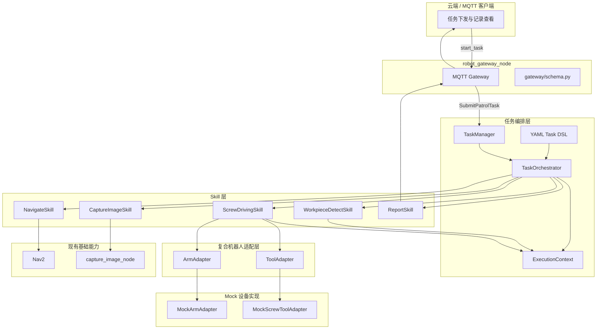
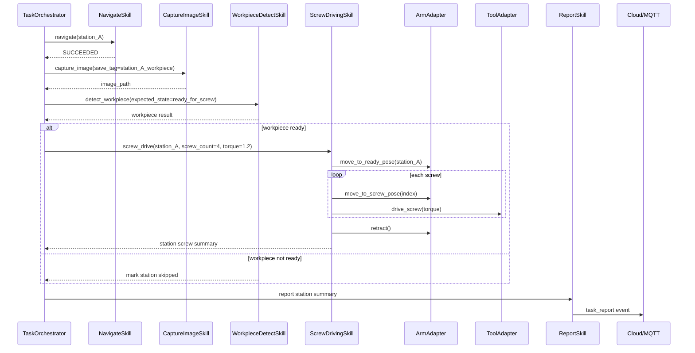

# 工业复合任务模拟技术方案：巡检 + 打螺丝闭环

> 适用分支：`feature-add-sim-task`  
> 适用工程：`patrol_robot` / `robot_gateway_node` / `patrol_interfaces`  
> 方案阶段：评审稿  
> 目标场景：基于当前巡检机器人工程，模拟复合机器人在工业工位间完成巡检、视觉识别、打螺丝、结果上报的任务闭环。

---

## 1. 背景

当前项目已经具备移动巡检机器人基础能力：

- Nav2 导航到指定工位；
- YAML DSL 编排任务步骤；
- `TaskManager + TaskOrchestrator + SkillRegistry` 执行任务；
- 拍照、异常检测、语音、任务上报等 Skill；
- MQTT 网关向云端上报 telemetry/events；
- 故障管理与恢复方案已规划独立架构。

但工业复合机器人不只是移动底盘。实际产品通常包含：

- 移动底盘；
- 机械臂；
- 末端工具；
- 视觉/感知；
- 任务编排系统；
- 云端任务平台；
- 故障与质量追溯系统。

本方案在现有工程上新增一个“工业复合任务模拟”能力，用 mock 机械臂和 mock 电批工具展示多子系统协同，而不是只展示单一导航巡检。

---

## 2. 目标与非目标

### 2.1 目标

实现一个可评审、可演示、可逐步落地的复合任务闭环：

```text
1. 导航到工位 A
2. 拍照识别工件状态
3. 模拟机械臂进入打螺丝动作
4. 返回执行结果
5. 上报任务记录
6. 导航到下一个工位
```

本期重点：

1. 在 DSL 中表达“移动 + 感知 + 作业 + 上报”的复合任务；
2. 新增 `ArmAdapter`、`ToolAdapter`、`ScrewDrivingSkill` 抽象；
3. 用 mock 实现机械臂和工具能力；
4. 每个工位形成汇总级任务结果；
5. 工件状态不满足或打螺丝失败时，不中断全局任务，跳过当前工位并继续下一个工位；
6. 上报复合任务记录，体现工位、工件状态、作业结果、质量数据。

### 2.2 非目标

本期不做：

- 不接入真实机械臂；
- 不做真实运动规划、轨迹规划、碰撞检测；
- 不接入真实电批或力控工具；
- 不引入 MoveIt 2；
- 不做每颗螺丝级事件流；
- 不新增复杂的 step 级 recovery DSL；
- 不新增独立云端平台；
- 不追求真实拧紧工艺闭环，只做接口和数据闭环模拟。

---

## 3. 已确认设计决策

| 编号 | 决策 | 说明 |
|------|------|------|
| D1 | `screw_drive` 失败后跳过当前工位，继续下一个工位 | 不因单工位作业失败中止整条巡检路线 |
| D2 | 工件状态不满足打螺丝条件不算任务失败 | 在上报信息中体现 `workpiece_not_ready` 或具体状态 |
| D3 | 第一版 `ArmAdapter` / `ToolAdapter` 只做 Python 内部接口 | 先验证编排和数据闭环，不引入 ROS service/action 运行复杂度 |
| D4 | 后续真实设备边界优先考虑 ROS Action | 机械臂/工具真实执行具有耗时、反馈、取消语义，Action 更适合长期动作 |
| D5 | MQTT 事件暂不拆得过细 | 第一版使用一个典型的工位汇总上报事件/记录 |
| D6 | 云端上报按工位汇总结果 | 不做每颗螺丝实时事件 |
| D7 | Mock 暂不要求随机失败 | 第一版可配置固定成功/失败即可；随机故障后续配合故障演示再做 |
| D8 | 可尝试基于现有机器人和地图做可视化 | 第一优先级是逻辑闭环；若成本可控，增加简化机械臂/工具模型 |
| D9 | MQTT topic 复用现有建议 | 新增专用 `CompositeTaskReport.msg`，但继续走现有 MQTT events 链路，不单独设计新 topic |
| D10 | 支持 `station_group` DSL 宏 | 减少多工位重复 YAML，加载时展开为标准 steps |
| D11 | `feature-add-sim-task` 已推送远端 | 本文档基于该分支整理 |

---

## 4. 总体架构



### 4.1 分层职责

| 层级 | 模块 | 职责 |
|------|------|------|
| 任务编排层 | `TaskManager` | 任务生命周期、状态发布、远程任务接入 |
| 任务编排层 | `TaskOrchestrator` | 按 DSL 顺序执行步骤，处理暂停/取消/失败策略 |
| 上下文层 | `ExecutionContext` | 在步骤间传递图片、工件识别、打螺丝结果 |
| Skill 层 | `WorkpieceDetectSkill` | 基于图片模拟工件状态识别 |
| Skill 层 | `ScrewDrivingSkill` | 编排机械臂和工具完成 mock 打螺丝动作 |
| 适配层 | `ArmAdapter` | 抽象机械臂能力 |
| 适配层 | `ToolAdapter` | 抽象末端工具能力 |
| Mock 层 | `MockArmAdapter` / `MockScrewToolAdapter` | 无真实硬件时提供可运行模拟 |
| 网关层 | `ReportSkill` / `robot_gateway_node` | 上报每个工位汇总记录 |

---

## 5. 任务流程

### 5.1 单工位闭环



### 5.2 多工位任务

```text
for station in route:
  navigate(station)
  capture_image()
  detect_workpiece()
  if workpiece.ready:
    screw_drive()
  else:
    mark station skipped
  report station summary
continue next station
```

关键语义：

- 工位级失败不等于任务级失败；
- 单个工位打螺丝失败后，记录失败原因并继续下一个工位；
- 整个任务只有在导航、编排、系统级错误等关键故障时才进入失败。

---

## 6. DSL 设计

### 6.1 新增 step 类型

| Step 类型 | 必填字段 | 行为 |
|----------|----------|------|
| `detect_workpiece` | `expected_state` | 模拟识别工件状态，写入 `ExecutionContext.last_workpiece` |
| `screw_drive` | `target`、`screw_count`、`torque_nm` | 模拟机械臂和工具完成打螺丝，写入 `ExecutionContext.last_screw_result` |
| `report` | `channel` | 复用现有上报链路，扩展 payload |

### 6.2 示例任务

新增任务文件建议：

```text
patrol_robot/config/tasks/industrial_screw_inspection.yaml
```

示例：

```yaml
name: industrial_screw_inspection
task_id: industrial_screw_demo
description: 工业复合场景：巡检 + 拍照识别 + 模拟打螺丝
on_failure: retry_step

steps:
  - type: navigate
    target: station_1

  - type: speak
    text: "到达一号工位，开始工件检测"
    optional: true

  - type: capture_image
    save_tag: station_1_workpiece

  - type: detect_workpiece
    model: mock_workpiece_detector
    expected_state: ready_for_screw

  - type: screw_drive
    target: station_1
    screw_count: 4
    torque_nm: 1.2
    timeout_sec: 15.0

  - type: report
    channel: mqtt

  - type: navigate
    target: station_2

  - type: speak
    text: "到达二号工位，开始工件检测"
    optional: true

  - type: capture_image
    save_tag: station_2_workpiece

  - type: detect_workpiece
    model: mock_workpiece_detector
    expected_state: ready_for_screw

  - type: screw_drive
    target: station_2
    screw_count: 4
    torque_nm: 1.2
    timeout_sec: 15.0

  - type: report
    channel: mqtt
```

### 6.3 工位级配置

第一版不增加复杂嵌套 DSL，只在 `screw_drive` step 中配置典型参数：

| 字段 | 类型 | 说明 |
|------|------|------|
| `target` | string | 工位名称，与 `stations.yaml` 对应 |
| `screw_count` | int | 当前工位螺丝数量 |
| `torque_nm` | float | 目标扭矩 |
| `timeout_sec` | float | 当前工位作业超时 |

后续如果需要更贴近真实工艺，可扩展：

```yaml
screws:
  - id: s1
    pose: p1
    torque_nm: 1.2
  - id: s2
    pose: p2
    torque_nm: 1.2
```

本期暂不引入。

---

## 7. 接口抽象

### 7.1 `ArmAdapter`

第一版为 Python 内部接口：

```python
class ArmAdapter:
  def move_to_ready_pose(self, station: str) -> ArmResult:
    ...

  def move_to_screw_pose(self, station: str, screw_index: int) -> ArmResult:
    ...

  def retract(self) -> ArmResult:
    ...

  def stop(self) -> None:
    ...
```

设计意图：

- `ScrewDrivingSkill` 不依赖具体机械臂实现；
- 后续可替换为 MoveIt 2、厂商 SDK、ROS Action client；
- mock 与真实机械臂共用同一 Skill 入口。

### 7.2 `ToolAdapter`

第一版为 Python 内部接口：

```python
class ToolAdapter:
  def enable(self) -> ToolResult:
    ...

  def drive_screw(self, torque_nm: float, timeout_sec: float) -> ToolResult:
    ...

  def disable(self) -> ToolResult:
    ...

  def stop(self) -> None:
    ...
```

### 7.3 结果对象

```python
@dataclass
class ArmResult:
  success: bool
  message: str = ''
  duration_sec: float = 0.0

@dataclass
class ToolResult:
  success: bool
  message: str = ''
  target_torque_nm: float = 0.0
  actual_torque_nm: float = 0.0
  duration_sec: float = 0.0
```

---

## 8. `ScrewDrivingSkill` 设计

### 8.1 职责

`ScrewDrivingSkill` 是复合动作 Skill，负责把机械臂和工具动作组织成一个工位级作业闭环：

```text
检查工件状态
  -> 机械臂 ready pose
  -> 工具 enable
  -> 循环执行 N 颗螺丝
  -> 工具 disable
  -> 机械臂 retract
  -> 写入工位汇总结果
```

### 8.2 执行逻辑

```python
class ScrewDrivingSkill(Skill):
  def execute(
    self,
    target: str,
    screw_count: int,
    torque_nm: float,
    timeout_sec: float,
    context: ExecutionContext,
  ) -> SkillResult:
    ...
```

核心规则：

1. 如果 `context.last_workpiece.state != ready_for_screw`：
   - 不执行打螺丝；
   - 写入 `last_screw_result.result = skipped`；
   - 返回 `SUCCEEDED`；
   - 上报中体现跳过原因。

2. 如果某颗螺丝失败：
   - 当前工位结果为 `failed` 或 `partial_failed`；
   - 记录失败的螺丝 index 和原因；
   - 返回 `SUCCEEDED`，让任务继续后续 `report` 和下一个工位；
   - 不把工位级作业失败升级为任务失败。

3. 如果机械臂/工具接口抛出不可处理异常：
   - 第一版仍建议转换为工位级失败记录；
   - 只有系统不可恢复或取消任务时才返回 `FAILED`。

### 8.3 工位结果示例

```json
{
  "station": "station_1",
  "result": "success",
  "screw_count": 4,
  "success_count": 4,
  "failed_count": 0,
  "target_torque_nm": 1.2,
  "actual_torque_nm": [1.18, 1.21, 1.20, 1.19],
  "duration_sec": 5.3,
  "message": "mock screw driving completed"
}
```

---

## 9. 工件识别设计

### 9.1 `WorkpieceDetectSkill`

新增 Skill：

```python
class WorkpieceDetectSkill(Skill):
  def execute(
    self,
    model: str,
    expected_state: str,
    context: ExecutionContext,
  ) -> SkillResult:
    ...
```

第一版 mock 行为：

- 读取 `context.last_image_path`；
- 生成一个工件状态；
- 写入 `context.last_workpiece`；
- 如果状态不是 `expected_state`，仍返回 `SUCCEEDED`；
- 是否执行打螺丝由 `ScrewDrivingSkill` 根据上下文决定。

### 9.2 工件状态枚举建议

第一版使用一个典型工况即可：

| 状态 | 含义 |
|------|------|
| `ready_for_screw` | 工件存在且状态满足打螺丝条件 |
| `not_ready` | 工件存在但不满足作业条件 |
| `missing` | 工件缺失 |
| `unknown` | 识别结果不确定 |

### 9.3 识别结果示例

```json
{
  "state": "ready_for_screw",
  "expected_state": "ready_for_screw",
  "matched": true,
  "confidence": 0.96,
  "model": "mock_workpiece_detector",
  "image_path": "/home/user/patrol_images/station_1_workpiece.jpg"
}
```

---

## 10. `ExecutionContext` 扩展

当前上下文已有：

```python
last_image_path: str | None
last_anomaly: dict | None
vars: dict[str, object]
```

建议扩展：

```python
last_workpiece: dict | None = None
last_screw_result: dict | None = None
station_results: list[dict] = field(default_factory=list)
```

用途：

| 字段 | 写入方 | 读取方 | 作用 |
|------|--------|--------|------|
| `last_workpiece` | `WorkpieceDetectSkill` | `ScrewDrivingSkill` / `ReportSkill` | 当前工位工件状态 |
| `last_screw_result` | `ScrewDrivingSkill` | `ReportSkill` | 当前工位作业结果 |
| `station_results` | `ReportSkill` 或 `ScrewDrivingSkill` | 任务结束汇总 | 多工位结果集合 |

如果第一版不希望修改 dataclass 字段，也可以先使用现有 `ctx.vars`：

```python
ctx.vars['last_workpiece'] = {...}
ctx.vars['last_screw_result'] = {...}
ctx.vars.setdefault('station_results', []).append(...)
```

建议第一版直接增加明确字段，提升可读性。

---

## 11. 上报设计

### 11.1 上报通道

第一版新增专用 ROS 消息，但复用现有 MQTT events 链路：

```text
ReportSkill
  -> /robot/composite_task_report
  -> robot_gateway_node
  -> MQTT events(event_type=composite_task_report)
```

不新增单独 MQTT topic。

专用消息：

```text
patrol_interfaces/msg/CompositeTaskReport.msg
```

### 11.2 工位汇总 payload

每个工位上报一条汇总记录：

```json
{
  "task_id": "industrial_screw_demo",
  "task_name": "industrial_screw_inspection",
  "station": "station_1",
  "step_type": "report",
  "image_path": "/home/user/patrol_images/station_1_workpiece.jpg",
  "workpiece": {
    "state": "ready_for_screw",
    "expected_state": "ready_for_screw",
    "matched": true,
    "confidence": 0.96,
    "model": "mock_workpiece_detector"
  },
  "screw_driving": {
    "result": "success",
    "screw_count": 4,
    "success_count": 4,
    "failed_count": 0,
    "target_torque_nm": 1.2,
    "actual_torque_nm": [1.18, 1.21, 1.2, 1.19],
    "duration_sec": 5.3,
    "message": "mock screw driving completed"
  },
  "station_result": "success",
  "timestamp": "2026-05-26T06:00:00Z",
  "source": "edge"
}
```

### 11.3 跳过工位 payload

```json
{
  "task_id": "industrial_screw_demo",
  "task_name": "industrial_screw_inspection",
  "station": "station_2",
  "workpiece": {
    "state": "not_ready",
    "expected_state": "ready_for_screw",
    "matched": false,
    "confidence": 0.82
  },
  "screw_driving": {
    "result": "skipped",
    "reason": "workpiece_not_ready"
  },
  "station_result": "skipped"
}
```

### 11.4 工位失败 payload

```json
{
  "station": "station_3",
  "workpiece": {
    "state": "ready_for_screw",
    "matched": true
  },
  "screw_driving": {
    "result": "partial_failed",
    "screw_count": 4,
    "success_count": 3,
    "failed_count": 1,
    "failed_indices": [2],
    "failure_reason": "mock_tool_failed"
  },
  "station_result": "failed"
}
```

---

## 12. ROS Action 预留边界

第一版不实现 ROS Action，但真实设备接入建议使用 Action，而不是 service。

原因：

- 打螺丝是长耗时动作；
- 需要反馈进度；
- 需要取消；
- 需要区分 accepted / executing / succeeded / failed；
- 后续可能需要云端或任务系统观察动作进度。

后续可定义：

```text
patrol_interfaces/action/ScrewDrive.action
```

草案：

```text
# Goal
string station
uint32 screw_count
float32 target_torque_nm
float32 timeout_sec
---
# Result
bool success
string result_code
string message
uint32 success_count
uint32 failed_count
string payload_json
---
# Feedback
uint32 current_screw_index
string phase
float32 progress
```

未来演进路径：

```text
ScrewDrivingSkill
  -> Python ArmAdapter/ToolAdapter       # 第一版
  -> ScrewDrive Action Client           # 真实或独立仿真节点
  -> 机械臂控制器 / 工具控制器
```

---

## 13. Mock 设备设计

### 13.1 `MockArmAdapter`

行为：

- `move_to_ready_pose(station)`：模拟机械臂从收纳姿态到作业预备位；
- `move_to_screw_pose(station, screw_index)`：模拟移动到第 N 颗螺丝；
- `retract()`：模拟机械臂回收；
- `stop()`：模拟停止。

参数建议：

```yaml
mock_arm_motion_delay_sec: 0.5
mock_arm_fail_station: ""
mock_arm_fail_screw_index: -1
```

### 13.2 `MockScrewToolAdapter`

行为：

- `enable()`：模拟电批启动；
- `drive_screw()`：返回模拟实际扭矩；
- `disable()`：模拟关闭工具；
- `stop()`：停止工具。

参数建议：

```yaml
mock_tool_delay_sec: 0.5
mock_tool_torque_noise_nm: 0.05
mock_tool_fail_station: ""
mock_tool_fail_screw_index: -1
```

说明：

- 本期不要求随机失败；
- 可通过固定参数模拟某工位或某颗螺丝失败；
- 便于演示“工位失败但全局任务继续”。

---

## 14. 可视化仿真方案

用户期望“能实现最好”。建议采用分阶段策略：

### 14.1 第一优先级：逻辑仿真

不改 Gazebo 模型，仅通过日志、任务状态和 MQTT payload 展示：

- 到达工位；
- 拍照；
- 识别；
- mock 机械臂作业；
- 工位报告；
- 前往下一工位。

该方式改动最小，最容易稳定演示。

### 14.2 第二优先级：轻量视觉模型

如果当前 URDF/xacro 结构允许，增加一个简化机械臂视觉模型：

```text
base_link
  -> mock_arm_base_link
  -> mock_arm_link_1
  -> mock_arm_link_2
  -> mock_screw_tool_link
```

特点：

- 仅做视觉展示；
- 不接入控制器；
- 不做运动学；
- 可在 RViz/Gazebo 中看到复合机器人形态。

### 14.3 暂不建议

本期不建议做：

- Gazebo 机械臂动力学控制；
- ros2_control 机械臂 controller；
- MoveIt 2 planning scene；
- 工具接触/力矩物理仿真。

这些会显著扩大范围，偏离“任务闭环评审”的核心目标。

---

## 15. 目录结构建议

```text
patrol_robot/patrol_robot/
├── adapters/
│   ├── __init__.py
│   ├── arm_adapter.py
│   ├── tool_adapter.py
│   ├── mock_arm_adapter.py
│   └── mock_tool_adapter.py
├── skills/
│   ├── detect_workpiece_skill.py
│   └── screw_driving_skill.py
└── orchestrator/
    └── execution_context.py

patrol_robot/config/tasks/
└── industrial_screw_inspection.yaml

docs/
└── 05.INDUSTRIAL_COMPOSITE_TASK_ARCHITECTURE.md
```

如实现轻量可视化，可增加：

```text
my_robot_description/urdf/parts/actuator/mock_arm.urdf.xacro
my_robot_description/urdf/parts/tool/mock_screw_tool.urdf.xacro
```

---

## 16. 与故障管理方案的关系

复合任务应与故障管理方案保持一致：

| 场景 | 处理方式 |
|------|----------|
| 导航失败 | 使用故障恢复方案中的导航重试与上报 |
| 拍照失败 | 默认告警并继续，关键工位可配置 required |
| 工件未准备好 | 不算任务失败，工位结果 `skipped` |
| 打螺丝失败 | 工位结果 `failed` 或 `partial_failed`，继续下一工位 |
| 工具 mock 异常 | 转换为工位失败记录 |
| 上报失败 | 不阻断主任务 |
| 用户取消任务 | 停止当前 mock arm/tool，任务取消 |

后续真实机械臂接入后，`ScrewDrivingSkill.cancel()` 应调用：

```text
ArmAdapter.stop()
ToolAdapter.stop()
```

---

## 17. 实施建议

### 17.1 第一阶段：逻辑闭环

1. 新增 `adapters/` 抽象和 mock 实现；
2. 新增 `WorkpieceDetectSkill`；
3. 新增 `ScrewDrivingSkill`；
4. 扩展 `ExecutionContext`；
5. 扩展 `TaskLoader.SUPPORTED_STEP_TYPES`；
6. 在 `TaskManager._build_registry()` 注册新 step；
7. 扩展 `ReportSkill` payload；
8. 新增 `industrial_screw_inspection.yaml`；
9. 通过 MQTT start_task 启动并观察上报。

### 17.2 第二阶段：可视化增强

1. 评估现有机器人 URDF/xacro；
2. 增加简化机械臂和电批视觉 link；
3. 在 RViz/Gazebo 中展示复合机器人外形；
4. 暂不做真实运动。

### 17.3 第三阶段：ROS Action 边界

1. 定义 `ScrewDrive.action`；
2. 将 `ScrewDrivingSkill` 改为 Action client；
3. 增加独立 mock screw action server；
4. 后续替换为真实机械臂/工具控制节点。

---

## 18. 验证策略

### 18.1 单元测试

| 测试项 | 预期 |
|--------|------|
| 工件状态 ready | `ScrewDrivingSkill` 执行 mock 打螺丝 |
| 工件状态 not_ready | 打螺丝跳过，Skill 返回成功 |
| mock 工具失败 | 工位结果 failed，任务继续 |
| mock 机械臂失败 | 工位结果 failed，任务继续 |
| report payload | 包含 workpiece 与 screw_driving 字段 |
| DSL 解析 | 支持 `detect_workpiece` 和 `screw_drive` |

### 18.2 集成验证

1. 启动 Nav2、patrol_node、gateway；
2. 下发 `industrial_screw_inspection`；
3. 观察机器人导航到 `station_1`；
4. 观察图片保存；
5. 观察 mock 工件识别日志；
6. 观察 mock 打螺丝日志；
7. 订阅 MQTT events，确认工位汇总上报；
8. 确认任务继续导航到 `station_2`；
9. 模拟某工位打螺丝失败，确认任务不终止。

### 18.3 手工观察命令

```bash
ros2 topic echo /robot/status
ros2 topic echo /robot/composite_task_report
mosquitto_sub -h 127.0.0.1 -t 'robots/robot_001/#' -v
```

---

## 19. Review 结论落地

| Review 项 | 落地结论 |
|-----------|----------|
| 工位失败语义 | `screw_drive` 返回 `SUCCEEDED`，通过 `station_result` 表达工位成功、跳过或失败，保证全局任务继续 |
| `station_result` 枚举 | 采用 `success / skipped / failed / partial_failed` |
| 工件状态枚举 | 第一版采用 `ready_for_screw / not_ready / missing / unknown` |
| 工位事件粒度 | 不拆分每颗螺丝事件，仅发布工位汇总结果 |
| 总报告 | `station_results` 在上下文中累积，任务末尾通过 `report(summary=true)` 统一上报 |
| Mock 失败配置 | 支持固定工位、固定螺丝序号失败，不引入随机失败 |
| 上报消息 | 新增 `CompositeTaskReport.msg`，网关转换为 `composite_task_report` MQTT event |
| 可视化 | 作为 best effort，允许静态机械臂模型，不阻塞逻辑闭环 |
| 真实设备接入 | 第一版 Python adapter；后续对不同原厂 SDK 使用 adapter 屏蔽差异，耗时作业边界预留 ROS Action |
| DSL 复用 | 支持 `station_group` 宏，减少多工位重复 YAML |

---

## 20. 已确认实现规则

1. 第一版典型工位固定为 4 颗螺丝、目标扭矩 1.2 Nm，可在 YAML 中覆盖。
2. 工件识别 mock 默认 `ready_for_screw`，也支持按工位参数覆盖。
3. `capture_image` 失败时，`detect_workpiece` 不使用默认图片；识别结果标记为 `unknown`，当前工位跳过打螺丝。
4. `screw_drive` 工位失败不设置 `/robot/status.fault_code`，只在 `CompositeTaskReport` 和 MQTT event 中体现。
5. 工位汇总结果包含图片路径，支持云端追溯。
6. `station_results` 在任务上下文累积，并在任务末尾形成总报告。
7. 若加入 URDF 可视化，第一版允许静态机械臂，不要求动作。
8. 代码结构按 adapter 和 Skill 分层，后续可平滑替换为 ROS Action client/server。

---

## 21. 评审结论

本方案将当前巡检机器人从“移动底盘巡逻”扩展为“复合机器人任务协同”的可演示架构：

```text
移动底盘导航
  + 视觉采集
  + 工件状态识别
  + 机械臂/工具抽象
  + mock 打螺丝作业
  + 工位级质量结果
  + 云端任务记录
```

第一版以 Python 内部接口和 mock 实现为主，保证工程闭环稳定、范围可控；同时预留 ROS Action 作为后续真实机械臂和工具接入边界。

建议按“逻辑闭环 -> 可视化增强 -> ROS Action 设备边界”的顺序推进。
