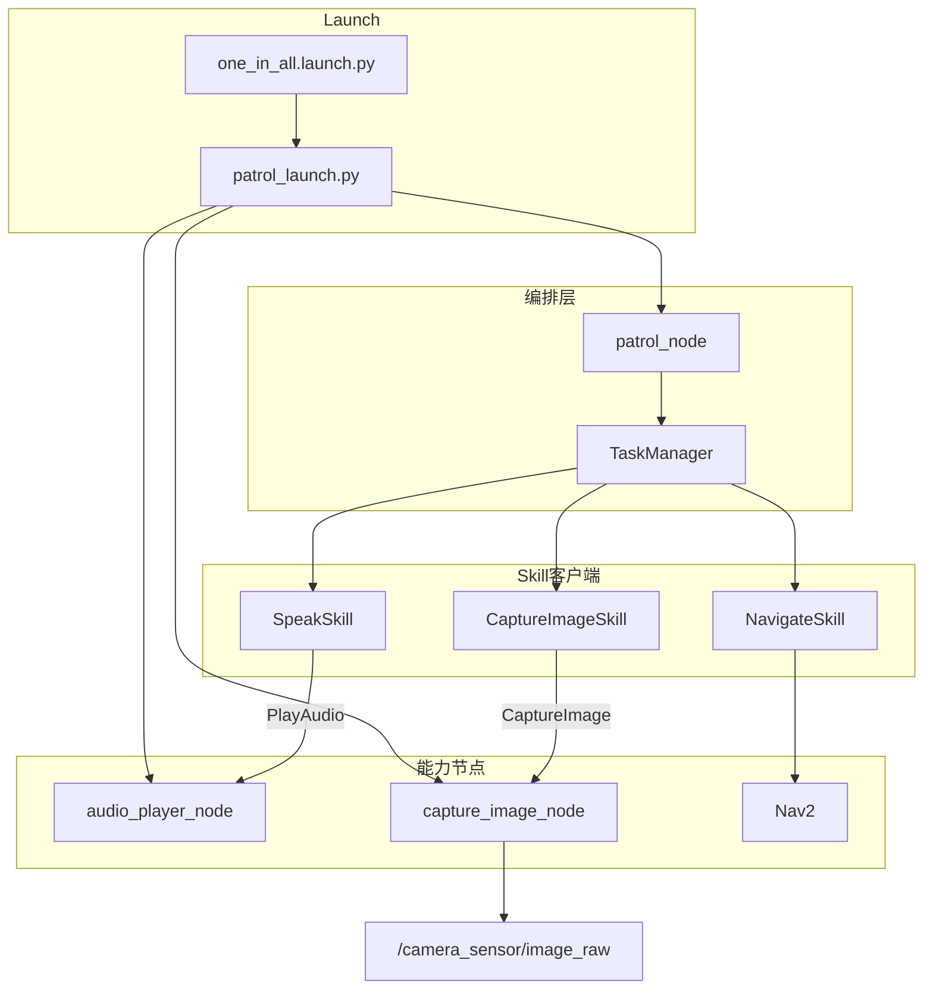
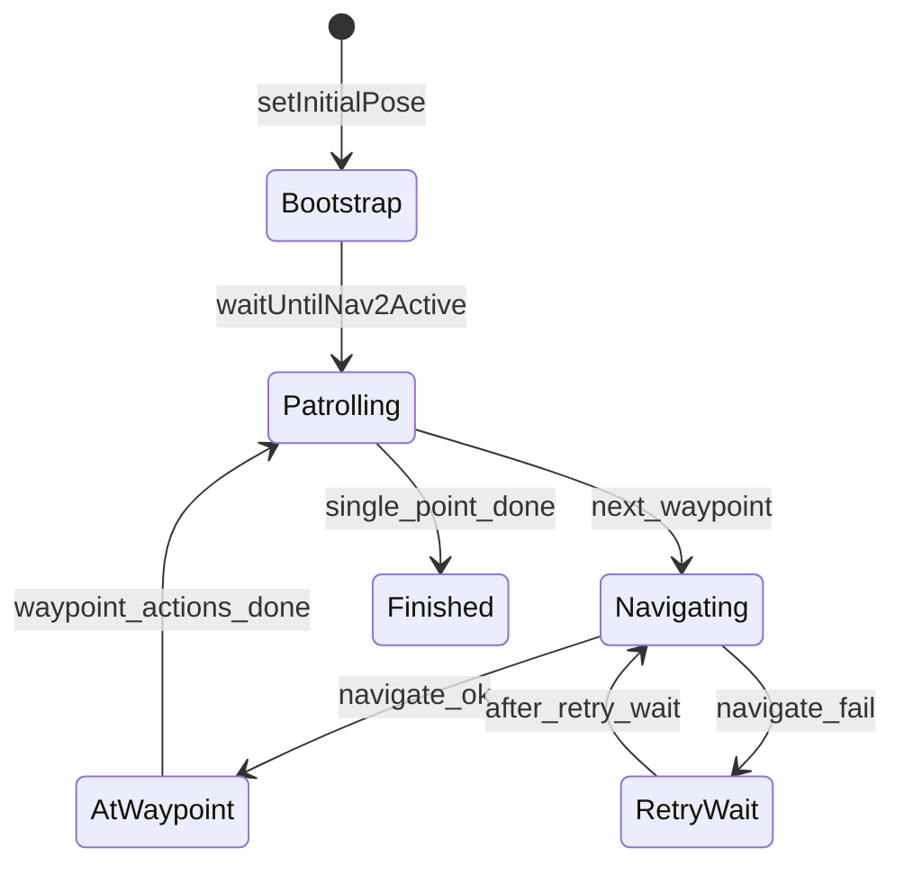
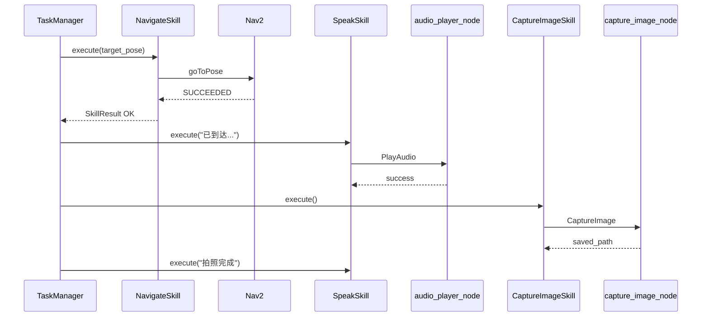

# 巡逻机器人任务/技能架构

本文档描述 `patrol_robot` 应用层的 **TaskManager + Skill** 重构设计，便于扩展新的到点动作或替换能力实现。

---

## 1. 设计目标

| 目标 | 说明 |
|------|------|
| 编排与能力分离 | `TaskManager` 管理路点序列与状态；原子能力由 `Skill` 封装 |
| 服务化对称 | 语音、拍照均为「独立节点 + `.srv` + Skill 客户端」 |
| 向后兼容 | `one_in_all.launch.py`、`patrol_config.yaml` 路点格式、`play_audio_service` 服务名不变 |

---

## 2. 分层架构



### 职责边界

| 组件 | 职责 |
|------|------|
| Nav2 | 定位、全局/局部规划、运动级恢复 |
| `NavigateSkill` | 封装 `BasicNavigator.goToPose` 与完成轮询 |
| `capture_image_node` | 订阅相机、缓存最新帧、按服务请求落盘 |
| `audio_player_node` | gTTS + pygame 播报 |
| `TaskManager` | 路点循环、到点动作链、导航失败重试 |

---

## 3. 类与模块

```
patrol_robot/patrol_robot/
├── patrol_node.py           # 薄入口：BasicNavigator + TaskManager
├── task_manager.py          # 状态机与巡逻主循环
├── capture_image_node.py    # 拍照服务节点
├── audio_player_node.py     # 语音服务节点
├── skills/
│   ├── base.py              # Skill, SkillResult, SkillStatus
│   ├── navigate_skill.py
│   ├── capture_image_skill.py
│   └── speak_skill.py
└── utils/
    └── pose_utils.py          # 路点解析与 PoseStamped 构造
```

### Skill 基类

```python
class SkillStatus(Enum):
    IDLE, RUNNING, SUCCEEDED, FAILED, CANCELED

@dataclass
class SkillResult:
    status: SkillStatus
    message: str = ''

class Skill(ABC):
    def execute(self, **kwargs) -> SkillResult: ...
    def cancel(self) -> None: ...
```

### TaskManager 状态机



**到点动作链（默认）**

1. `SpeakSkill` —「已到达目标点, 准备拍照」
2. `sleep(waypoint_stabilize_sec)`（默认 2s）
3. `CaptureImageSkill`
4. `sleep(1s)`
5. `SpeakSkill` —「拍照完成」
6. 多点巡逻：`SpeakSkill` —「三秒后前往下一个目标点」+ `sleep(inter_waypoint_delay_sec)`

---

## 4. ROS 接口

### PlayAudio.srv（已有）

```
string text_to_speak
---
bool success
string message
```

服务名：`/play_audio_service`

### CaptureImage.srv（新增）

```
string filename_prefix
---
bool success
string message
string saved_path
```

服务名：`/capture_image_service`

### 能力对称表

| 能力 | 节点 | 服务 | Skill |
|------|------|------|-------|
| 语音 | `audio_player_node` | `play_audio_service` | `SpeakSkill` |
| 拍照 | `capture_image_node` | `capture_image_service` | `CaptureImageSkill` |
| 导航 | — | Nav2 Action | `NavigateSkill` |

---

## 5. 配置

### patrol_config.yaml（`patrol_node`）

```yaml
patrol_node:
  ros__parameters:
    initial_pose: { x, y, yaw }
    patrol_points: ["x,y,yaw_deg", ...]
    navigate_retry_wait_sec: 60.0
    waypoint_stabilize_sec: 2.0
    inter_waypoint_delay_sec: 3.0
```

### capture_config.yaml（`capture_image_node`）

```yaml
capture_image_node:
  ros__parameters:
    picture_save_dir: "/path/to/save"
    image_topic: "/camera_sensor/image_raw"
```

---

## 6. 运行时

- `patrol_node` 使用 `MultiThreadedExecutor` 后台 `spin`，主线程运行 `TaskManager.run()`。
- `capture_image_node`、`audio_player_node` 各自 `rclpy.spin()`。
- `SpeakSkill` / `CaptureImageSkill` 通过 `spin_until_future_complete` 同步等待服务响应。

---

## 7. 序列图：到点一次完整流程



---

## 8. 手动测试

```bash
# 语音
ros2 service call /play_audio_service patrol_interfaces/srv/PlayAudio \
  "{text_to_speak: '你好，我是巡逻机器人'}"

# 拍照（需 Gazebo 相机在发布）
ros2 service call /capture_image_service patrol_interfaces/srv/CaptureImage \
  "{filename_prefix: 'manual_test'}"
```

---

## 9. 扩展指南

1. **新增 Skill**：继承 `Skill`，实现 `execute()`；若为重型 IO，建议仿照拍照/语音拆独立节点 + srv。
2. **修改到点流程**：编辑 `TaskManager._run_waypoint_actions()`，或后续引入 `waypoint_actions` 配置 DSL。
3. **新增巡逻任务**：可新增 `TaskManager` 子类或策略对象，复用同一套 Skill 实例。

---

## 10. 编排演进：行为树（BT）

### 10.1 现状

`TaskManager` 使用 **`PatrolTaskState` 枚举 + `_patrol_loop()`**，不是 Behavior Tree。  
**Nav2** 内部已有 BT（`bt_navigator`），只管单次导航的运动与恢复，与业务编排分层。

### 10.2 BT 在做什么

BT 通过周期性 **tick**，节点返回 **SUCCESS / FAILURE / RUNNING**，由 Sequence、Fallback 等组合节点决定「当前做谁、成功后走哪枝、失败后是否重试/换策略」。  
可理解为持续回答：**现在执行什么、下一步走哪条分支**——与状态机「事件驱动切换状态」是不同模型，**并非比状态机更高级**，而是**更擅长**多分支、重试链、可配置子树。

### 10.3 何时考虑把 TaskManager 换成 BT

| 仍用状态机即可 | 可考虑业务层 BT |
|----------------|-----------------|
| 路点循环 + 固定到点动作链 | 到点动作可配置、种类多 |
| 少量 pause/cancel | 大量异常分支、并行监控（电量/障碍） |
| 逻辑主要在调 Skill/服务 | 运维希望改 XML/YAML 而不改 Python |

### 10.4 可行迁移方式（推荐分层）

```
MQTT / submit_patrol_task → 黑板/触发器 → 业务 BT（替代 TaskManager 循环）
                                              ↓
                                         Skill（不变）
                                              ↓
                                         Nav2 导航 BT（不变）
```

- **只替换编排层**；`NavigateSkill` / `SpeakSkill` / `CaptureImageSkill` 映射为 BT 叶子节点即可。  
- 远程任务、`/robot/status`、MQTT 网关接口可保持不变，BT 只改「任务怎么跑完」。  
- 需注意：现有 `execute()` 阻塞与 `time.sleep` 需改为 tick 友好（RUNNING 轮询或异步）。  
- 技术选型：全 Python 包可优先考虑 **py_trees**；若与 Nav2 运维统一，可用 **BehaviorTree.CPP**（与 `nav2_behavior_tree` 同生态）。

### 10.5 建议演进顺序

1. 配置化 `waypoint_actions`（仍用状态机）  
2. 将「单航点：导航 → 动作链」抽成可复用子流程  
3. 业务复杂度仍失控时，再引入 BT 根树，避免与 Nav2 运动 BT 合并为一棵巨树  

---

## 11. 与旧版差异

| 旧版 `patrol_node` | 新版 |
|--------------------|------|
| 单类含导航+相机+语音 | `patrol_node` 仅编排 |
| 硬编码图片路径 | `capture_config.yaml` 的 `picture_save_dir` |
| `patrol_loop()` | `TaskManager.run()` |
| 无状态枚举 | `PatrolTaskState` + `SkillStatus` |
